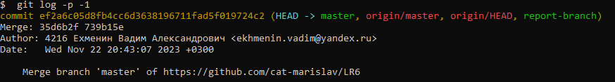

# LR6
Лабораторная работа №6
## Цель работы
Изучение базовых возможностей системы управления версиями, опыт работы с Git Api, опыт работы с локальным и удаленным репозиторием.
## Ход работы
1. Создать аккаунт на сайте GitHub.
2. Сделать копию в личное хранилище из https://github.com/Kurtyanik/LR6/ (Fork).

3. Установить Git (https://git-scm.com/).

4. После установки настроить клиент git, введя имя пользователя (Группа
Фамилия И.О.) и email.

5. Клонировать свой личный удалённый репозиторий на компьютер.

6. Добавить файл через интерфейс GitHub. Подтянуть изменения в
локальный репозиторий.
Добавление файла:

Подтягивание в локальный репозиторий:

7. Получить историю операций для каждой из веток.

8. Просмотреть последние изменения.

9. Выполнить слияние в ветку master, разрешив конфликт (можно использовать специальные редакторы или графический интерфейс git).

10. Удалить побочную ветку после успешного слияния.

11. Сделать изменения и зафиксировать их, оставляя комментарии, несколько раз.

12. Сделать откат коммита.

13. Создать ветку для отчёта.

14. Начать оформлять отчёт в файле README.md.
15. Получить историю операций в форматированном виде (сокращённый хэш + дата + имя автора + комментарий). Добавить её в отчёт и сделать финальную фиксацию изменений.

Финальная фиксация изменений:

16. Отправить локальные изменения в сетевое хранилище GitHub (если делаете работу постепенно, то синхронизацию проводить в конце рабочего сеанса)

## Вывод
В ходе выполения лабораторной работы были изучены базовые возможности системы управления версиями, получен опыт работы с Git Api и опыт работы с локальным и удаленным репозиторием.
>>>>>>> report-branch
